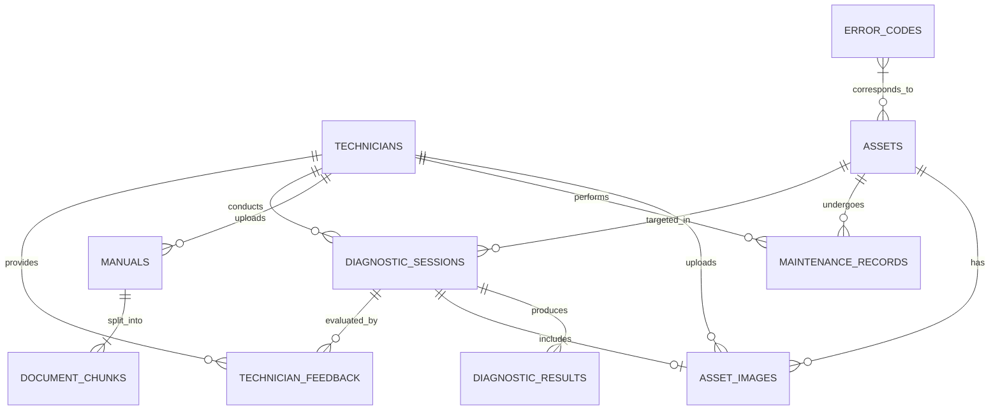

# Supabase PostgreSQL + pgvector Database Schema Specification

## 1. Overview
The **Multimodal Field-Service Maintenance Assistant** uses **Supabase PostgreSQL** extended with **pgvector** and **Supabase Storage**.
This architecture provides relational data modeling for assets and maintenance history, binary storage for technical manuals and inspection images, and dense vector similarity search for grounded Retrieval-Augmented Generation (RAG).

---

## 2. Entity Relationship Diagram



---

## 3. Detailed Entity Dictionary

### 3.1 `technicians`
- **Purpose**: Authenticated field service personnel, engineers, and maintenance operators.
- **Columns**:
  - `id`: `UUID PRIMARY KEY DEFAULT gen_random_uuid()`
  - `email`: `VARCHAR(255) NOT NULL UNIQUE`
  - `full_name`: `VARCHAR(255) NOT NULL`
  - `role`: `VARCHAR(50) NOT NULL DEFAULT 'technician'` (`technician`, `senior_technician`, `supervisor`, `admin`)
  - `created_at`: `TIMESTAMPTZ NOT NULL DEFAULT CURRENT_TIMESTAMP`
  - `updated_at`: `TIMESTAMPTZ NOT NULL DEFAULT CURRENT_TIMESTAMP`
- **Indexes**: `email`, `role`, `created_at`

### 3.2 `assets`
- **Purpose**: Industrial machinery, production lines, and field equipment.
- **Columns**:
  - `id`: `UUID PRIMARY KEY DEFAULT gen_random_uuid()`
  - `asset_code`: `VARCHAR(100) NOT NULL UNIQUE` (e.g. `HVAC-CHILLER-04`)
  - `name`: `VARCHAR(255) NOT NULL`
  - `equipment_type`: `VARCHAR(100) NOT NULL` (e.g. `Chiller`, `Pump`, `Generator`)
  - `manufacturer`: `VARCHAR(150) NOT NULL` (e.g. `Trane`, `Siemens`, `Grundfos`)
  - `model`: `VARCHAR(150) NOT NULL`
  - `serial_number`: `VARCHAR(150) NOT NULL`
  - `location`: `VARCHAR(255) NOT NULL` (e.g. `Plant 2 - Mechanical Room 102`)
  - `operational_status`: `VARCHAR(50) NOT NULL DEFAULT 'operational'` (`operational`, `degraded`, `critical`, `under_maintenance`, `decommissioned`)
  - `installation_date`: `DATE`
  - `last_maintenance_date`: `TIMESTAMPTZ`
  - `created_at`: `TIMESTAMPTZ NOT NULL DEFAULT CURRENT_TIMESTAMP`
  - `updated_at`: `TIMESTAMPTZ NOT NULL DEFAULT CURRENT_TIMESTAMP`
- **Indexes**: `asset_code`, `equipment_type`, `manufacturer`, `operational_status`, `location`, `created_at`

### 3.3 `asset_images`
- **Purpose**: Metadata for uploaded inspection photos, damage evidence, and thermal scans.
- **Columns**:
  - `id`: `UUID PRIMARY KEY DEFAULT gen_random_uuid()`
  - `asset_id`: `UUID NOT NULL REFERENCES assets(id) ON DELETE CASCADE`
  - `technician_id`: `UUID REFERENCES technicians(id) ON DELETE SET NULL`
  - `storage_path`: `VARCHAR(500) NOT NULL` (Path in `equipment-images` bucket)
  - `file_name`: `VARCHAR(255) NOT NULL`
  - `content_type`: `VARCHAR(100) NOT NULL DEFAULT 'image/jpeg'`
  - `image_type`: `VARCHAR(50) NOT NULL DEFAULT 'inspection'` (`nameplate`, `overall`, `component`, `damage`, `thermal`, `inspection`)
  - `analysis_status`: `VARCHAR(50) NOT NULL DEFAULT 'pending'` (`pending`, `processing`, `completed`, `failed`)
  - `created_at`: `TIMESTAMPTZ NOT NULL DEFAULT CURRENT_TIMESTAMP`
- **Indexes**: `asset_id`, `technician_id`, `image_type`, `created_at`

### 3.4 `error_codes`
- **Purpose**: Standardized diagnostic trouble codes, fault descriptions, and recommended checks.
- **Columns**:
  - `id`: `UUID PRIMARY KEY DEFAULT gen_random_uuid()`
  - `equipment_type`: `VARCHAR(100) NOT NULL`
  - `manufacturer`: `VARCHAR(150) NOT NULL`
  - `code`: `VARCHAR(100) NOT NULL` (e.g. `E-241`)
  - `title`: `VARCHAR(255) NOT NULL`
  - `description`: `TEXT NOT NULL`
  - `possible_causes`: `JSONB DEFAULT '[]'::jsonb`
  - `recommended_checks`: `JSONB DEFAULT '[]'::jsonb`
  - `safety_warnings`: `JSONB DEFAULT '[]'::jsonb`
  - `severity`: `VARCHAR(50) NOT NULL DEFAULT 'warning'` (`info`, `warning`, `critical`, `fatal`)
  - `created_at`: `TIMESTAMPTZ NOT NULL DEFAULT CURRENT_TIMESTAMP`
  - `updated_at`: `TIMESTAMPTZ NOT NULL DEFAULT CURRENT_TIMESTAMP`
- **Constraints**: Unique on `(code, manufacturer)`
- **Indexes**: `code`, `equipment_type`, `manufacturer`, `severity`, `created_at`

### 3.5 `maintenance_records`
- **Purpose**: Historical work orders, preventive repairs, and emergency fixes.
- **Columns**:
  - `id`: `UUID PRIMARY KEY DEFAULT gen_random_uuid()`
  - `asset_id`: `UUID NOT NULL REFERENCES assets(id) ON DELETE CASCADE`
  - `technician_id`: `UUID REFERENCES technicians(id) ON DELETE SET NULL`
  - `maintenance_type`: `VARCHAR(100) NOT NULL` (`preventive`, `corrective`, `emergency`, `inspection`, `calibration`)
  - `issue_description`: `TEXT`
  - `diagnosis`: `TEXT`
  - `action_taken`: `TEXT NOT NULL`
  - `parts_replaced`: `JSONB DEFAULT '[]'::jsonb`
  - `downtime_minutes`: `INTEGER DEFAULT 0`
  - `maintenance_date`: `TIMESTAMPTZ NOT NULL DEFAULT CURRENT_TIMESTAMP`
  - `notes`: `TEXT`
  - `created_at`: `TIMESTAMPTZ NOT NULL DEFAULT CURRENT_TIMESTAMP`
- **Indexes**: `asset_id`, `technician_id`, `maintenance_type`, `maintenance_date DESC`, `created_at`

### 3.6 `manuals`
- **Purpose**: Technical manuals, electrical schematics, and SOP documentation.
- **Columns**:
  - `id`: `UUID PRIMARY KEY DEFAULT gen_random_uuid()`
  - `title`: `VARCHAR(255) NOT NULL`
  - `manufacturer`: `VARCHAR(150) NOT NULL`
  - `equipment_type`: `VARCHAR(100) NOT NULL`
  - `model`: `VARCHAR(150)`
  - `document_type`: `VARCHAR(100) NOT NULL DEFAULT 'oem_manual'` (`oem_manual`, `service_bulletin`, `schematic`, `sop`, `troubleshooting_guide`, `parts_catalog`)
  - `storage_path`: `VARCHAR(500) NOT NULL` (Path in `manuals-and-docs` bucket)
  - `file_name`: `VARCHAR(255) NOT NULL`
  - `processing_status`: `VARCHAR(50) NOT NULL DEFAULT 'pending'` (`pending`, `processing`, `indexed`, `failed`)
  - `page_count`: `INTEGER DEFAULT 0`
  - `uploaded_by`: `UUID REFERENCES technicians(id) ON DELETE SET NULL`
  - `created_at`: `TIMESTAMPTZ NOT NULL DEFAULT CURRENT_TIMESTAMP`
  - `updated_at`: `TIMESTAMPTZ NOT NULL DEFAULT CURRENT_TIMESTAMP`
- **Indexes**: `equipment_type`, `manufacturer`, `model`, `processing_status`, `uploaded_by`, `created_at`

### 3.7 `document_chunks`
- **Purpose**: Segmented text chunks from technical manuals indexed with 768-dimensional embeddings.
- **Columns**:
  - `id`: `UUID PRIMARY KEY DEFAULT gen_random_uuid()`
  - `manual_id`: `UUID NOT NULL REFERENCES manuals(id) ON DELETE CASCADE`
  - `chunk_index`: `INTEGER NOT NULL`
  - `content`: `TEXT NOT NULL`
  - `page_number`: `INTEGER`
  - `metadata`: `JSONB DEFAULT '{}'::jsonb`
  - `embedding`: `vector(768)`
  - `created_at`: `TIMESTAMPTZ NOT NULL DEFAULT CURRENT_TIMESTAMP`
- **Indexes**:
  - `idx_doc_chunks_manual_id` ON `manual_id`
  - `idx_doc_chunks_page_number` ON `page_number`
  - `idx_doc_chunks_created_at` ON `created_at`
  - **HNSW Index**: `idx_doc_chunks_embedding_hnsw` USING `hnsw (embedding vector_cosine_ops) WITH (m = 16, ef_construction = 64)`

### 3.8 `diagnostic_sessions`
- **Purpose**: Troubleshooting inquiry sessions initiated by field technicians.
- **Columns**:
  - `id`: `UUID PRIMARY KEY DEFAULT gen_random_uuid()`
  - `asset_id`: `UUID REFERENCES assets(id) ON DELETE SET NULL`
  - `technician_id`: `UUID REFERENCES technicians(id) ON DELETE SET NULL`
  - `user_question`: `TEXT NOT NULL`
  - `image_id`: `UUID REFERENCES asset_images(id) ON DELETE SET NULL`
  - `status`: `VARCHAR(50) NOT NULL DEFAULT 'pending'` (`pending`, `processing`, `completed`, `failed`)
  - `created_at`: `TIMESTAMPTZ NOT NULL DEFAULT CURRENT_TIMESTAMP`
  - `completed_at`: `TIMESTAMPTZ`
- **Indexes**: `asset_id`, `technician_id`, `image_id`, `status`, `created_at`

### 3.9 `diagnostic_results`
- **Purpose**: Structured AI outputs, safety warnings, troubleshooting steps, and traceable citations.
- **Columns**:
  - `id`: `UUID PRIMARY KEY DEFAULT gen_random_uuid()`
  - `diagnostic_session_id`: `UUID NOT NULL REFERENCES diagnostic_sessions(id) ON DELETE CASCADE`
  - `issue_summary`: `TEXT NOT NULL`
  - `identified_error_code`: `VARCHAR(100)`
  - `confidence`: `NUMERIC(5, 4)`
  - `probable_causes`: `JSONB DEFAULT '[]'::jsonb`
  - `recommended_steps`: `JSONB DEFAULT '[]'::jsonb`
  - `required_tools`: `JSONB DEFAULT '[]'::jsonb`
  - `safety_warnings`: `JSONB DEFAULT '[]'::jsonb`
  - `citations`: `JSONB DEFAULT '[]'::jsonb` (Contains manual_id, page_number, chunk_id, excerpt, title)
  - `model_name`: `VARCHAR(100)`
  - `response_time_ms`: `INTEGER`
  - `created_at`: `TIMESTAMPTZ NOT NULL DEFAULT CURRENT_TIMESTAMP`
- **Indexes**: `diagnostic_session_id`, `identified_error_code`, `created_at`

### 3.10 `technician_feedback`
- **Purpose**: Human-in-the-loop evaluation and post-service validation log.
- **Columns**:
  - `id`: `UUID PRIMARY KEY DEFAULT gen_random_uuid()`
  - `diagnostic_session_id`: `UUID NOT NULL REFERENCES diagnostic_sessions(id) ON DELETE CASCADE`
  - `technician_id`: `UUID REFERENCES technicians(id) ON DELETE SET NULL`
  - `rating`: `INTEGER NOT NULL CHECK (rating >= 1 AND rating <= 5)`
  - `feedback_text`: `TEXT`
  - `was_helpful`: `BOOLEAN NOT NULL`
  - `actual_root_cause`: `TEXT`
  - `created_at`: `TIMESTAMPTZ NOT NULL DEFAULT CURRENT_TIMESTAMP`
- **Indexes**: `diagnostic_session_id`, `technician_id`, `rating`, `created_at`

---

## 4. Vector Search Function (`match_document_chunks`)

The function calculates cosine similarity `1 - (embedding <=> query_embedding)` and returns ranked matches:

```sql
CREATE OR REPLACE FUNCTION match_document_chunks(
    query_embedding vector(768),
    match_threshold float,
    match_count int
)
RETURNS TABLE (
    id UUID,
    manual_id UUID,
    content TEXT,
    page_number INT,
    metadata JSONB,
    similarity float
)
LANGUAGE plpgsql
AS $$
BEGIN
    RETURN QUERY
    SELECT
        dc.id,
        dc.manual_id,
        dc.content,
        dc.page_number,
        dc.metadata,
        (1 - (dc.embedding <=> query_embedding))::float AS similarity
    FROM document_chunks dc
    WHERE dc.embedding IS NOT NULL
      AND (1 - (dc.embedding <=> query_embedding)) > match_threshold
    ORDER BY dc.embedding <=> query_embedding
    LIMIT match_count;
END;
$$;
```

---

## 5. Storage Buckets

1. **`equipment-images`**:
   - **Access**: Public read, service-role / authenticated write
   - **Max File Size**: 20 MB
   - **Allowed MIME Types**: `image/jpeg`, `image/png`, `image/webp`, `image/heic`
2. **`manuals-and-docs`**:
   - **Access**: Private (signed URLs or backend streaming)
   - **Max File Size**: 100 MB
   - **Allowed MIME Types**: `application/pdf`, `application/msword`, `application/vnd.openxmlformats-officedocument.wordprocessingml.document`

---

## 6. Security & Row-Level Security (RLS)

- **Backend-Only Service-Role Key**: The `SUPABASE_SERVICE_ROLE_KEY` is maintained exclusively in server environments and is never sent to the browser.
- **RLS Enforcement**: Enabled on all 10 application tables.
- **Service Role Bypass Policy**: Allows the backend service full CRUD capabilities across all tables while public/anon access is restricted to read-only where appropriate.
- **File Validation**: All uploads are strictly checked for size limits and verified MIME types.
